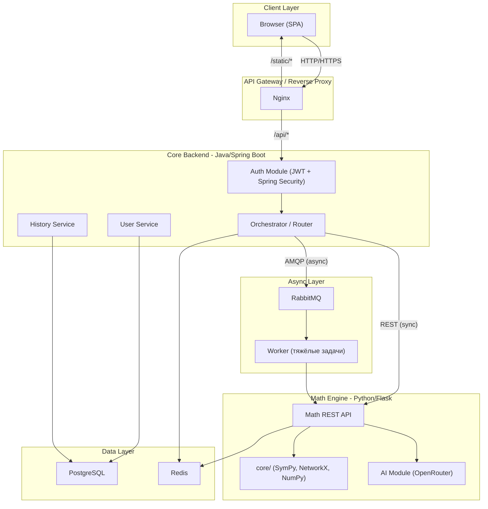
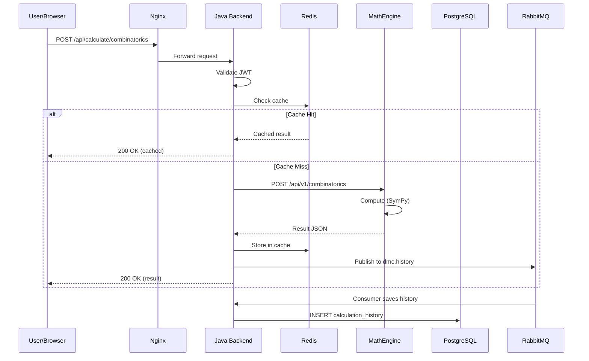

# DMC System Design - Полная архитектура системы

## 1. Текущее состояние (AS-IS)

Сейчас DMC - **монолитное Flask-приложение** ([web_app.py](web_app.py), 1545 строк), в котором смешаны:

- Раздача HTML-шаблонов (Jinja2) и статики
- Вся бизнес-логика и валидация (marshmallow-схемы)
- 20+ API-эндпоинтов (`/api/logic`, `/api/automata`, `/api/graph_theory`, и т.д.)
- AI-чатбот (OpenRouter)
- Математические вычисления (`core/`)
- Нет БД (только Flask session), нет аутентификации, нет Docker

---

## 2. Целевая архитектура (TO-BE)




---

## 3. Детальное описание каждого компонента

### 3.1. Frontend (SPA - Client Layer)

**Технологии:** HTML5, CSS3, Vanilla JS (сейчас); React/Vue.js + Tailwind CSS (в будущем)

**Текущий подход (Phase 1):**

- Вытащить все HTML-шаблоны из Jinja2 в чистые HTML-страницы
- Убрать зависимость от Flask для рендеринга - фронт становится **полностью статическим**
- Все взаимодействие с бэкендом через `fetch()` к REST API
- Оставить Bootstrap 5, Cytoscape.js, Font Awesome
- Nginx раздает статику напрямую (не через Flask/Java)

**Будущее (Phase 2):**

- Миграция на React (рекомендую) или Vue.js + Tailwind CSS
- Компонентный подход: `<GraphEditor/>`, `<TruthTableBuilder/>`, `<AutomatonVisualizer/>`
- State management: Zustand (React) или Pinia (Vue)

**Рекомендация:** Для вайбкодинга Vanilla JS + Bootstrap - отличный выбор на старте. Когда frontend станет сложнее (больше интерактива, состояний), мигрировать на React. Vue.js тоже хорош, но React даст больше для резюме/диплома.

---

### 3.2. Core Backend (Java / Spring Boot)

**Роль:** API Gateway + оркестратор + IAM + бизнес-логика

**Технологии:**

- Java 17+ / Spring Boot 3.x
- Spring Security + JWT (аутентификация)
- Spring Data JPA + Hibernate (ORM)
- MapStruct (маппинг DTO <-> Entity)
- Spring AMQP (RabbitMQ клиент)
- Spring Data Redis (кеширование)
- RestTemplate / WebClient (HTTP-клиент к Math Engine)
- Flyway (миграции БД)
- Lombok (сокращение boilerplate)

**Модули Java-бэкенда:**

```
backend/
  src/main/java/com/dmc/
    config/           # SecurityConfig, RedisConfig, RabbitConfig, WebClientConfig
    security/         # JwtTokenProvider, JwtAuthFilter, UserDetailsServiceImpl
    controller/
      AuthController        # POST /api/auth/register, /login, /refresh
      UserController        # GET/PUT /api/users/me, аватар
      CalculationController # POST /api/calculate/{module}  -> маршрутизация в Math Engine
      ChatController        # POST /api/chat  -> маршрутизация в AI Module
      HistoryController     # GET /api/history
    service/
      AuthService
      UserService
      CalculationOrchestrator  # валидация + маршрутизация + сохранение в историю
      HistoryService
    client/
      MathEngineClient     # WebClient: вызовы Python Math Engine
    model/
      User, Role, CalculationHistory, ChatSession
    dto/
      RegisterRequest, LoginResponse, CalculationRequest, CalculationResponse...
    mapper/
      UserMapper, CalculationMapper  (MapStruct)
    repository/
      UserRepository, HistoryRepository (Spring Data JPA)
    exception/
      GlobalExceptionHandler (@ControllerAdvice)
```

**Ключевые эндпоинты Java Backend:**


| Метод | Путь                      | Описание                               |
| ----- | ------------------------- | -------------------------------------- |
| POST  | `/api/auth/register`      | Регистрация                            |
| POST  | `/api/auth/login`         | Аутентификация, возврат JWT            |
| POST  | `/api/auth/refresh`       | Обновление токена                      |
| GET   | `/api/users/me`           | Профиль текущего пользователя          |
| PUT   | `/api/users/me`           | Обновление профиля                     |
| POST  | `/api/calculate/{module}` | Делегирование вычисления в Math Engine |
| POST  | `/api/chat`               | Проксирование AI-запроса               |
| GET   | `/api/history`            | История вычислений пользователя        |


**Поток запроса на вычисление:**

1. Фронт -> `POST /api/calculate/combinatorics` с JWT
2. Java: валидация JWT -> валидация входных данных -> проверка Redis-кеша
3. Cache miss -> `POST http://math-engine:8081/api/v1/combinatorics` (WebClient)
4. Ответ от Math Engine -> сохранение в Redis + запись истории через RabbitMQ
5. Возврат результата клиенту

---

### 3.3. Math Engine (Python / Flask)

**Роль:** Stateless вычислительный микросервис

**Технологии:** Flask 2.3 (текущий); в будущем FastAPI

**Рекомендация по Flask vs FastAPI:** Оставить Flask на данном этапе - весь код уже написан. Миграция на FastAPI имеет смысл позже, когда нужна async поддержка и авто-документация (Swagger). Для диплома Flask более чем достаточен.

**Структура:**

```
math-engine/
  app.py                 # Flask entry point, CORS, error handlers
  api/
    v1/
      combinatorics.py   # Blueprint: /api/v1/combinatorics
      automata.py        # Blueprint: /api/v1/automata
      graph_theory.py    # Blueprint: /api/v1/graph_theory
      set_theory.py      # Blueprint: /api/v1/set_theory
      logic.py           # Blueprint: /api/v1/logic
      number_theory.py   # Blueprint: /api/v1/number_theory
      probability.py     # Blueprint: /api/v1/probability
      ai_chat.py         # Blueprint: /api/v1/chat
  core/                  # (существующий код - без изменений)
    automata/
    combinatorics/
    graph_theory/
    set_theory/
    logic/
    number_theory/
    discrete_probability/
    algebraic_structures/
    visualization/
  ai/
    chatbot.py           # OpenRouter (существующий)
    model/               # (будущее: custom model)
  schemas/               # Marshmallow schemas (из web_app.py)
  requirements.txt
  Dockerfile
```

**Ключевое изменение:** Разбить монолитный `web_app.py` на Flask Blueprints. Каждый модуль - отдельный Blueprint. Math Engine **не знает** про пользователей, JWT, историю. Он просто считает и возвращает результат.

---

### 3.4. AI Module (внутри Math Engine)

**Phase 1 (сейчас):** OpenRouter API через `ai/chatbot.py` - уже работает

**Phase 2 (диплом - RAG):** Retrieval-Augmented Generation

- Индексировать учебники по дискретной математике в векторной БД (ChromaDB или FAISS)
- При запросе пользователя: поиск релевантных фрагментов -> добавление в контекст промпта -> отправка в LLM
- Это **реально для диплома** и создает ощущение "собственной модели"

**Phase 3 (опционально - Fine-tuning):**

- Базовая модель: **Qwen2.5-Math** (специально для математики) или Mistral 7B
- Fine-tuning через **LoRA/QLoRA** (PEFT от Hugging Face)
- Датасет: GSM8K + MATH + собственные задачи по дискретной математике
- Hardware: Google Colab Pro (A100) или университетский GPU-кластер
- Время: 2-4 недели на подготовку данных + тюнинг
- **Инференс:** llama.cpp или vLLM для локального запуска

**Моя рекомендация по AI для диплома:**

1. Полноценная модель с нуля - **НЕ реально** (нужны миллионы долларов на compute)
2. Fine-tuning маленькой модели с LoRA - **РЕАЛЬНО**, но ресурсоёмко
3. RAG (ChromaDB + OpenRouter) - **ОПТИМАЛЬНЫЙ выбор** для диплома: впечатляющий результат при минимальных ресурсах
4. Компромисс: RAG + fine-tuned Qwen2.5-Math-1.5B (самая маленькая, крутится даже на CPU)

**Стек для AI модуля:**

- `transformers` + `peft` (Hugging Face) - для fine-tuning
- `chromadb` или `faiss-cpu` - для векторного поиска (RAG)
- `sentence-transformers` - для создания эмбеддингов
- `langchain` (опционально) - для пайплайна RAG

---

### 3.5. Redis

**Порт:** 6379

**Использование:**

1. **Кеширование вычислений:** `hash(module + params)` -> результат, TTL 1 час. Одинаковые запросы не пересчитываются.
2. **Rate Limiting:** Ограничение запросов к AI-модулю (например, 10 запросов/минуту на пользователя)
3. **Blacklist JWT-токенов:** При logout - добавление токена в blacklist до его expires
4. **Сессии (опционально):** Если понадобится серверная сессия помимо JWT

---

### 3.6. RabbitMQ

**Порт:** 5672 (AMQP), 15672 (management UI)

**Очереди:**


| Очередь             | Producer     | Consumer           | Назначение                                            |
| ------------------- | ------------ | ------------------ | ----------------------------------------------------- |
| `dmc.audit`         | Java Backend | Java Worker        | Логирование действий пользователей                    |
| `dmc.history`       | Java Backend | Java Worker        | Асинхронная запись истории вычислений                 |
| `dmc.heavy-compute` | Java Backend | Math Engine Worker | Тяжёлые вычисления (большие графы, длинные симуляции) |


**Когда НЕ нужен RabbitMQ:** Для простых вычислений (факториал, GCD, таблица истинности) - синхронный REST достаточен. RabbitMQ только для задач > 5 секунд.

---

### 3.7. PostgreSQL

**Порт:** 5432

**Схема БД (основные таблицы):**

- **users** - `id`, `email`, `username`, `password_hash`, `avatar_url`, `role`, `created_at`, `updated_at`
- **roles** - `id`, `name` (ROLE_USER, ROLE_ADMIN)
- **user_roles** - `user_id`, `role_id` (many-to-many)
- **calculation_history** - `id`, `user_id`, `module` (combinatorics/graph/...), `input_json`, `result_json`, `execution_time_ms`, `created_at`
- **chat_sessions** - `id`, `user_id`, `title`, `created_at`
- **chat_messages** - `id`, `session_id`, `role` (user/assistant), `content`, `created_at`

**Миграции:** Flyway (Java) - версионирование схемы через SQL-файлы `V1__create_users.sql`, `V2__create_history.sql` и т.д.

---

## 4. Структура проекта (TO-BE)

```
dmc/
  frontend/                  # SPA (Vanilla JS -> React)
    index.html
    pages/
      hub.html
      calculator.html
      graph-theory.html
      combinatorics.html
      ...
    css/
      style.css
    js/
      app.js                 # Router, API client
      modules/
        graph_theory.js
        combinatorics.js
        automata.js
        ...
      components/
        chatbot.js
        navigation.js
    assets/
      favicon.ico

  backend/                   # Java / Spring Boot
    src/
      main/
        java/com/dmc/...
        resources/
          application.yml
          db/migration/      # Flyway
      test/
    build.gradle             # или pom.xml
    Dockerfile

  math-engine/               # Python / Flask
    app.py
    api/v1/
    core/                    # существующий math код
    ai/
    schemas/
    requirements.txt
    Dockerfile

  docker/
    nginx/
      nginx.conf
      default.conf

  docker-compose.yml
  .env
  README.md
```

---

## 5. Docker Compose

Сервисы:


| Сервис      | Образ                 | Порт (внутренний) | Порт (хост) |
| ----------- | --------------------- | ----------------- | ----------- |
| nginx       | nginx:alpine          | 80                | 80          |
| backend     | openjdk:17 (custom)   | 8080              | 8080        |
| math-engine | python:3.11 (custom)  | 8081              | 8081        |
| postgres    | postgres:16           | 5432              | 5432        |
| redis       | redis:7-alpine        | 6379              | 6379        |
| rabbitmq    | rabbitmq:3-management | 5672, 15672       | 5672, 15672 |


---

## 6. Поток данных (Data Flow)




---

## 7. Рекомендации и советы

### Что оставить как есть:

- Весь `core/` модуль - он отлично написан и работает
- `ai/chatbot.py` - просто переместить в math-engine
- Библиотеки: SymPy, NetworkX, NumPy, Matplotlib - идеальный выбор

### Что изменить:

- Разбить `web_app.py` на Flask Blueprints (по модулям)
- Убрать Jinja2 рендеринг - фронт станет SPA
- Убрать marshmallow-схемы из `web_app.py` в отдельную папку `schemas/`
- Добавить версионирование API (`/api/v1/...`)

### По Java Backend:

- **Gradle** предпочтительнее Maven (гибче, быстрее)
- Сразу настроить Spring Profiles: `dev`, `prod`
- Начать с простого: Auth + Orchestrator. Остальное - итеративно

### По фронтенду:

- Для вайбкодинга: Vanilla JS + Bootstrap - ОК на старте
- Но рекомендую сразу подключить простой SPA-роутер (например, Navigo) вместо многостраничности

### По инфраструктуре:

- Docker Compose с самого начала - это упрощает разработку
- Hot-reload для Java: Spring DevTools
- Hot-reload для Python: Flask debug mode (уже есть)

---

## 8. Порядок реализации (Phases)

**Phase 1 - Foundation (2-3 недели):**
Разбить `web_app.py` на Flask Blueprints. Создать Java backend со Spring Boot (auth + proxy к Math Engine). Настроить Docker Compose. Базовая схема PostgreSQL.

**Phase 2 - Integration (2-3 недели):**
Подключить Redis (кеширование). Подключить RabbitMQ (история, аудит). Превратить фронт в SPA. Полная JWT-аутентификация.

**Phase 3 - AI Enhancement (2-3 недели):**
Реализовать RAG с ChromaDB. Подготовить датасет по дискретной математике. Опционально: fine-tune Qwen2.5-Math-1.5B.

**Phase 4 - Polish (1-2 недели):**
Тесты (JUnit + Testcontainers для Java, pytest для Python). Документация API (Swagger/OpenAPI). Code coverage >=70%.